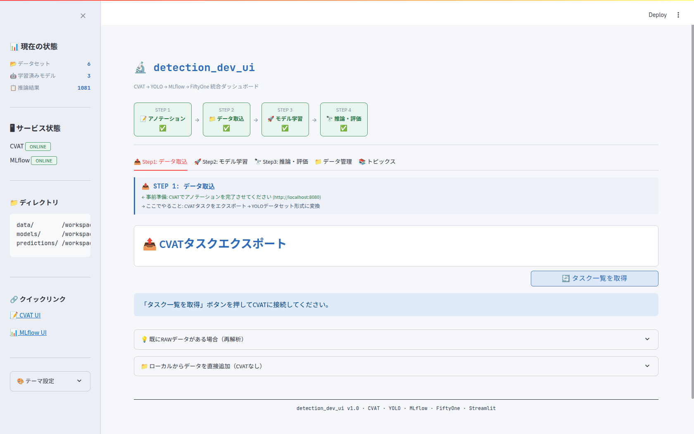

# detection_dev_ui — 初心者向け 画像検出パイプライン

[](LICENSE)

CVAT → YOLO → MLflow → FiftyOne を Docker Compose で統合した、**ターミナル操作不要・GUI完結**の物体検出 MLOps システムです。

> **初心者の方へ**: 機械学習・物体検出の経験が浅い方でも扱えるように設計しています。
> セットアップ後はブラウザ操作のみで、アノテーション → 学習 → 推論・評価まで一連のワークフローを完結させることができます。
> ターミナルを使うのはセットアップ時（Step 1〜7）だけです。
> CVATの形式関連で詰まることが多かったので作成しました。
> ぜひ、なれたらそれぞれの要素を自分で一通りできるように頑張ってみてください^^

---

## 動作確認済み環境

| 項目                     | 要件                            |
| ------------------------ | ------------------------------- |
| OS                       | Ubuntu 22.04 LTS                |
| Docker                   | 24.x 以上                       |
| Docker Compose           | v2.x 以上                       |
| GPU                      | NVIDIA GPU（VRAM 8GB 以上推奨） |
| NVIDIAドライバ           | 520 以上                        |
| CUDA                     | 12.x 系                         |
| nvidia-container-toolkit | 1.14 以上                       |

> GPU非搭載環境でも動作しますが、YOLO学習はCPUのみとなり速度が大幅に低下します。
> CPU動作時は `docker-compose.yml` の `streamlit_app` から `deploy.resources.reservations` ブロックを削除してください。

### ディスク容量の目安

| 対象                                | 目安       |
| ----------------------------------- | ---------- |
| Docker イメージ（初回ダウンロード） | 30〜50 GB  |
| アノテーション画像・データセット    | 用途による |
| 学習済みモデル（1モデルあたり）     | 10〜200 MB |

> 初回セットアップ時に大量の Docker イメージをダウンロードするため、
> **余裕を持って 60 GB 以上の空き容量**を確保しておくことを推奨します。

---

## システム構成

```
detection_dev_ui/
├── docker-compose.yml       # 全コンテナ統括
├── .env                     # 認証情報（要作成・gitignore済み）
├── .gitignore
├── LICENSE                  # AGPL-3.0
├── docker-compose.serverless.yml  # CVAT自動アノテーション(Nuclio)オーバーライド
├── nginx/
│   └── cvat.conf            # CVATリバースプロキシ
├── app/
│   ├── Dockerfile           # Streamlit統合UIコンテナ
│   ├── requirements.txt
│   ├── main.py              # Streamlit アプリ本体
│   ├── bytetrack.yaml       # ByteTracker 設定（track_buffer 等を編集可）
│   └── botsort.yaml         # BoT-SORT 設定（track_buffer 等を編集可）
├── serverless/              # CVAT自動アノテーション用の自作YOLO関数一式
│   ├── deploy.sh            # 関数のビルド&デプロイ（nuctl自動導入）
│   ├── remove.sh            # 関数の削除
│   ├── _common/            # 全関数共通の推論ハンドラ（main.py / model_handler.py）
│   ├── custom/             # モデルごとの関数定義（function.yaml / model.env）
│   └── README.md           # 自動アノテーションのセットアップ手順
├── docs/
│   ├── guide.md
│   └── cvat_shortcuts.md    # CVAT よく使うショートカット集
├── data/                    # CVATエクスポート先 / YOLO入力元（gitignore済み）
├── models/                  # YOLO学習済み重み（gitignore済み）
└── predictions/             # 推論結果JSON / エクスポート画像（gitignore済み）
    ├── exports/             # 結果画像の書き出し先（PNG / JPEG）
    └── videos/              # 動画推論の出力先（アノテーション済み MP4 + サマリー JSON）
```

### サービス一覧とポート

| サービス  | コンテナ名        | URL                   | 役割                   |
| --------- | ----------------- | --------------------- | ---------------------- |
| Streamlit | `streamlit_app` | http://localhost:8501 | 統合UI（メイン・起点） |
| CVAT UI   | `cvat_proxy`    | http://localhost:8080 | アノテーション         |
| MLflow UI | `mlflow`        | http://localhost:5000 | 実験管理               |
| FiftyOne  | `streamlit_app` | http://localhost:5151 | 推論結果可視化         |
| Nuclio    | `nuclio`        | http://localhost:8070 | 自動アノテーション基盤（任意・serverless有効時） |

### 起動後の画面

セットアップ完了後、`http://localhost:8501` を開くと以下の画面が表示されます。



---

## セットアップ手順

### Step 1 — nvidia-container-toolkit のインストール

```bash
curl -fsSL https://nvidia.github.io/libnvidia-container/gpgkey \
  | sudo gpg --dearmor -o /usr/share/keyrings/nvidia-container-toolkit-keyring.gpg

curl -s -L https://nvidia.github.io/libnvidia-container/stable/deb/nvidia-container-toolkit.list \
  | sed 's#deb https://#deb [signed-by=/usr/share/keyrings/nvidia-container-toolkit-keyring.gpg] https://#g' \
  | sudo tee /etc/apt/sources.list.d/nvidia-container-toolkit.list

sudo apt-get update
sudo apt-get install -y nvidia-container-toolkit
sudo nvidia-ctk runtime configure --runtime=docker

# Linux の場合
sudo systemctl restart docker

# macOS（Docker Desktop）の場合は systemctl は不要
# → Docker Desktop アプリをメニューバーから「Restart」するか、一度終了して再起動してください
```

### Step 2 — docker グループへの追加

```bash
sudo usermod -aG docker $USER
newgrp docker

# 動作確認
docker run --rm --gpus all nvidia/cuda:12.8.1-base-ubuntu22.04 nvidia-smi
```

### Step 3 — リポジトリのクローン

```bash
# SSH（GitHubにSSHキーを登録済みの場合）
git clone git@github.com:ryotaema/detection_dev_ui.git

# HTTPS（SSHキーが設定されていない場合はこちら）
git clone https://github.com/ryotaema/detection_dev_ui.git

cd detection_dev_ui
```

### Step 4 — .env ファイルの作成

```bash
cat > .env << 'EOF'
COMPOSE_PROJECT_NAME=mlops_workspace
CVAT_USERNAME=admin
CVAT_PASSWORD=your_password_here
CVAT_DB_PASSWORD=your_db_password_here
CVAT_IAM_DB_PASSWORD=your_iam_db_password_here
NVIDIA_VISIBLE_DEVICES=all
EOF
```

> `.env` はGitの追跡対象外です。各パスワードは必ず強い値に変更してください。

### Step 5 — CVATデータベースの初期化

> **必須・初回のみ**: このステップを省略すると CVAT が「Cannot connect to the server」エラーになります。

```bash
# DB・Redis系コンテナを先に起動（初回のみ）
docker compose up -d cvat_db cvat_redis cvat_redis_inmem cvat_redis_ondisk cvat_iam_db
sleep 30

# 初期化実行（初回のみ: migrate + migrateredis + syncperiodicjobs を一括実行）
docker compose run --rm cvat_server init

# スーパーユーザー作成（初回のみ）
docker compose run --rm cvat_server bash -c \
  "~/manage.py createsuperuser --username admin --email admin@local.com"
```

**ユーザー名は必ず `admin` にしてください。**
Streamlit が CVAT API にアクセスする際、`.env` の `CVAT_USERNAME` と一致するアカウントを使用します。
現在の設定では `CVAT_USERNAME=admin` のため、別のユーザー名にすると Streamlit からの接続が失敗します。
（将来的に複数ユーザーで運用する場合も、Streamlit 連携用の `admin` アカウントは残しておく必要があります。）

**パスワードは英大文字・数字・記号を含む 8 文字以上にしてください。**設定したパスワードは `.env` の `CVAT_PASSWORD` にも同じ値を記載してください。コマンド実行中に `Bypass password validation and create user anyway? [y/N]:` と表示された場合は、パスワードが弱すぎるため `N` で中断し、より強いパスワードで再実行してください。

> **CVATへのログイン情報**: セットアップ完了後、`http://localhost:8080` を開いた際のサインイン画面には、ここで作成した **ユーザー名 `admin`・設定したパスワード** を入力してください。

### Step 6 — 全サービス起動

```bash
docker compose up -d
sleep 30 && docker compose ps
```

> **初回起動時間の目安**: Docker イメージのダウンロードとビルドに **10〜30 分程度** かかります（回線速度・マシンスペックによって異なります）。
> 2 回目以降はキャッシュが効くため数分で起動します。

### Step 7 — 疎通確認

```bash
curl -s http://localhost:8080/api/server/about | python3 -m json.tool | head -3  # CVAT
curl -s http://localhost:5000/health                                               # MLflow
curl -s -o /dev/null -w "%{http_code}" http://localhost:8501                       # Streamlit
```

---

## 日常的な起動・停止

```bash
# 起動
docker compose up -d

# 停止
docker compose down

# ログ確認
docker compose logs -f streamlit_app

# アップデート（リポジトリに更新があった場合）
git pull
docker compose build streamlit_app && docker compose up -d streamlit_app
# ※ docker-compose.yml や requirements.txt に変更があった場合は全サービス再起動
# docker compose down && docker compose up -d
```

---

## 運用フロー

```
① CVATでアノテーション
   http://localhost:8080 → admin / 設定したパスワード でログイン
   プロジェクト作成 → 画像アップロード → バウンディングボックス / ポリゴンを付ける
   ・自作モデルによる自動アノテーションで下書きを作れる（後述「CVAT 自動アノテーション」）
   ・よく使うショートカットは docs/cvat_shortcuts.md（アプリ内は F1 で一覧）

② Streamlit「📤 Step1: データ取込」タブ
   http://localhost:8501 を開く
   「タスク一覧を取得」→ 対象タスクを選択（複数可）
   →「エクスポート実行」→ ラベル・タスク種別（detect/segment）を設定
   →「データセット生成」→ data/ に YOLO 形式で展開される

③ Streamlit「🚀 Step2: モデル学習」タブ
   学習プリセットを選んで「▶ 適用」（または手動でパラメータ設定）
     - 組み込みプリセット: ノーマル / 速度優先 / バランス型 / 精度優先 / 小物体向け / ロボット視点
     - カスタムプリセット: 現在の設定に名前を付けて保存・編集・削除が可能
   「学習開始」→ バックグラウンドで実行
   → エポックごとに mAP50 / Loss のリアルタイムグラフとログが表示される
   → MLflow にメトリクスが自動記録される（http://localhost:5000）
   → 学習完了時にトースト通知＋バルーンアニメーション

④ Streamlit「🔭 Step3: 推論・評価」タブ

   【推論対象の選択】
   - 📂 data/ のディレクトリ  — 学習時に生成したテスト画像フォルダを指定
   - 📤 画像をアップロード    — JPG / PNG 等を複数選択してアップロード
   - 🎬 動画をアップロード    — MP4 / AVI / MOV / MKV / WebM に対応

   【動画推論オプション】（動画モード選択時に表示）
   - 🔄 オブジェクトトラッキング ON/OFF
     - ByteTrack: 高速・位置ベースのトラッキング
     - BoT-SORT: 外観特徴も使用し遮蔽に強いトラッキング
     - 設定は `app/bytetrack.yaml` / `app/botsort.yaml` を編集して調整可（再起動不要）
   - 🕐 テンポラル平滑化（ちらつき抑制）ON/OFF
     - 補完フレーム数をスライダーで調整（1〜30フレーム）
     - 消えた検出をグレーのボックスで一時的に補完描画

   【推論実行後】
   - 画像: バウンディングボックス付きプレビューをグリッドで確認
   - 動画: アノテーション済み MP4 をその場で再生 / ダウンロード
          フレームごとの検出数グラフ・ユニークトラック数を表示（トラッキング時）

   【📥 結果画像エクスポート】
   → 「すべて書き出す」または「選択して書き出す」
   → PNG / JPEG 形式で predictions/exports/ に保存 → ZIP ダウンロード

   【🚩 再アノテーション用エクスポート】
   → プレビューまたは選択グリッドの 🚩 ボタンで問題のある画像にフラグを立てる
     （誤検出・検出漏れなど）
   → 「再アノテーション用 ZIP を生成」で以下をまとめてダウンロード:
     - `images/`        元画像（BBOX なし）
     - `labels/`        YOLO 形式 txt（class_id cx cy w h）
     - `classes.txt`    クラス名一覧
     - `annotations.xml` CVAT for images 1.1 形式（推論結果を事前アノテーションとして含む）
   → CVAT でタスクを作成 → 画像をアップロード → Actions > Upload annotations
     → 形式「CVAT for images 1.1」で `annotations.xml` を選択
     → 推論結果が事前アノテーション済みの状態で修正作業を開始できる

   【FiftyOne で可視化】→ http://localhost:5151 でブラウザ確認

⑤ Streamlit「📁 データ管理」タブ（任意）
   data/ のデータセット一覧・削除・統合
   models/ の学習済みモデルをカード形式で表示（mAP50・サイズ・学習日時付き）・削除・使用切替
   predictions/ の推論結果一括クリア
```

### データセット生成後の `data/` ディレクトリ構造

「データセット生成」を実行すると `data/` 以下に以下の構造でファイルが展開されます。

```
data/
└── {タスク名}_{日時}/
    ├── images/
    │   ├── train/      # 学習用画像
    │   └── val/        # 検証用画像
    ├── labels/
    │   ├── train/      # 学習用アノテーション（YOLO形式 .txt）
    │   └── val/        # 検証用アノテーション（YOLO形式 .txt）
    └── data.yaml       # クラス名・パス設定（学習時に自動参照）
```

---

## CVAT 自動アノテーション（Nuclio serverless・任意）

自作の学習済み YOLO モデル（`models/<run>/weights/best.pt`）を、CVAT の
**Actions → Automatic annotation** から呼び出して自動でバウンディングボックスを
付けられる機能。CVAT は [Nuclio](https://nuclio.io/) というサーバレス基盤経由で
モデルを実行する。詳細な手順・新モデル追加方法・トラブルシューティングは
**[`serverless/README.md`](serverless/README.md)** を参照。

```
CVAT UI（Actions → Automatic annotation）
   │  画像 + しきい値
   ▼
nuclio ダッシュボード(:8070) ── cvat_net ── 関数コンテナ（best.pt 内蔵）→ 検出結果
```

### 使い方（3ステップ）

```bash
# 1) Nuclio 基盤 + CVAT serverless 連携を起動
docker compose -f docker-compose.yml -f docker-compose.serverless.yml \
  up -d nuclio cvat_server cvat_worker_annotation

# 2) 自作モデルを関数としてデプロイ（既定 GPU / --cpu で CPU）
#    初回は nuctl を serverless/bin/ に自動ダウンロードし、イメージをビルドする
./serverless/deploy.sh

# 3) CVAT (http://localhost:8080) でタスクを開き
#    Actions → Automatic annotation → 自作モデルを選択 → ラベル対応付け → Annotate
```

### 補足

- **既定は GPU 版**（`function-gpu.yaml`・CUDA 12.8 / cu128）。GPU を関数に割り当てるには
  Docker daemon の `default-runtime` を `nvidia` にする必要がある（下記）。
  daemon を変えたくない場合は `./serverless/deploy.sh --cpu` で CPU 版を使う。
- GPU 有効化: `/etc/docker/daemon.json` に `"default-runtime": "nvidia"` を追加して
  `sudo systemctl restart docker`（**稼働中の全コンテナが再起動する**点に注意）。
- 関数の状態は Nuclio ダッシュボード http://localhost:8070 でも確認できる。
- 手修正の効率化には [`docs/cvat_shortcuts.md`](docs/cvat_shortcuts.md)（CVAT ショートカット集）も参照。

---

## Dockerfile の CUDA バージョン設定

`app/Dockerfile` のベースイメージと PyTorch インストール URL は、
**お使いの CUDA バージョンに合わせて変更**してください。

```dockerfile
# 現在の設定（CUDA 12.8 / RTX 50系対応）
FROM nvidia/cuda:12.8.1-cudnn-runtime-ubuntu22.04

RUN pip install --no-cache-dir torch torchvision torchaudio \
      --index-url https://download.pytorch.org/whl/cu128
```

| CUDA | `--index-url` の末尾 | ベースイメージタグ例                       |
| ---- | ---------------------- | ------------------------------------------ |
| 11.8 | `cu118`              | `cuda:11.8.0-cudnn8-runtime-ubuntu22.04` |
| 12.1 | `cu121`              | `cuda:12.1.1-cudnn8-runtime-ubuntu22.04` |
| 12.4 | `cu124`              | `cuda:12.4.1-cudnn-runtime-ubuntu22.04`  |
| 12.6 | `cu126`              | `cuda:12.6.3-cudnn-runtime-ubuntu22.04`  |
| 12.8 | `cu128`              | `cuda:12.8.1-cudnn-runtime-ubuntu22.04`  |

> RTX 50系（Blackwell / sm_120）は CUDA 12.8 以上が必要です。cu126 では `no kernel image` エラーが発生します。

利用可能なイメージ一覧: https://hub.docker.com/r/nvidia/cuda/tags
PyTorch 対応ビルド一覧: https://pytorch.org/get-started/locally/

---

## トラブルシューティング

### `docker` コマンドで permission denied が出る

```bash
sudo usermod -aG docker $USER
newgrp docker
```

### コンテナ名が競合してエラーになる

```
Error response from daemon: Conflict. The container name "/cvat_redis_ondisk" is already in use ...
```

別の CVAT 環境など、同名のコンテナがすでに存在している場合に発生します。

**① 同じリポジトリ内の起動済みコンテナが原因の場合**

```bash
docker compose down && docker compose up -d
```

**② 別プロジェクトの CVAT など、外部の同名コンテナが原因の場合**

競合しているコンテナを停止・削除してから起動してください。

```bash
# 競合コンテナの確認
docker ps -a --format "table {{.Names}}\t{{.Status}}" | grep cvat

# 停止・削除（すべての停止済みコンテナをまとめて削除する場合）
docker container prune

# または名前を指定して個別削除
docker rm -f cvat_redis_ondisk
```

> `data/`・`models/`・`predictions/` はホスト側の bind mount のため、コンテナを削除してもデータは保持されます。

### CVAT が「Cannot connect to the server」になる

Step 5 の初期化が不完全な場合に発生します。以下を順に確認してください。

**① コンテナ起動直後の場合**
`cvat_server` の起動完了に 1〜2 分かかります。しばらく待ってからブラウザを再読み込みしてください。

**② Step 5 の `init` を実行していない場合**
`migrate` のみ実行して `migrateredis` が未実行だと、`cvat_server` が内部で無限待機します。
すでに `docker compose up -d` 済みの場合は以下で解消できます：

```bash
docker compose exec cvat_server bash -c "~/manage.py migrateredis"
docker compose exec cvat_server bash -c "~/manage.py syncperiodicjobs"
```

完了後、ブラウザを再読み込みするとサインイン画面が表示されます。

### FiftyOne が Streamlit 内に表示されない

ブラウザのセキュリティポリシー（iframe 制限）により、Streamlit 画面内に埋め込み表示されない場合があります。
その場合は直接 http://localhost:5151 をブラウザで開いてください。

### GPU 非搭載環境で動かしたい（CPU のみ）

`docker-compose.yml` の `streamlit_app` から以下のブロックを削除してください：

```yaml
deploy:
  resources:
    reservations:
      devices:
        - driver: nvidia
          count: all
          capabilities: [gpu]
```

---

## 備考

- `version: "3.8"` の警告（`the attribute version is obsolete`）は Docker Compose v2 系の仕様変更によるもので、動作には影響ありません。
- 本システムは完全ローカル動作のため、外部ネットワークへのデータ転送は発生しません。
- `data/`・`models/`・`predictions/` はホスト側の bind mount のため、コンテナを削除してもデータは保持されます。
- CVAT: `v2.64.0` / cvat-sdk: `2.64.0`（サーバーと SDK を同一バージョンに固定）
- ユーザー定義プリセットは `models/.user_presets.json` に保存されます。
- ユーザー定義テーマは `models/.user_themes.json` に保存されます。
- トラッカー設定（`app/bytetrack.yaml` / `app/botsort.yaml`）はホストとコンテナがバインドマウントで共有されるため、ファイルを保存するだけで次回推論から反映されます（再起動不要）。
- 動画推論の出力は `predictions/videos/` に保存され、画像推論の `predictions/*.json` とは分離されています。
- 🚩 再アノテーション用フラグはブラウザセッション中のみ保持されます（リロードするとリセット）。

---

## ライセンス

このプロジェクトは [GNU Affero General Public License v3.0](LICENSE) の下で公開されています。

使用しているライブラリのライセンス:

| ライブラリ                                                  | ライセンス |
| ----------------------------------------------------------- | ---------- |
| [Ultralytics YOLO](https://github.com/ultralytics/ultralytics) | AGPL-3.0   |
| [CVAT](https://github.com/opencv/cvat)                         | MIT        |
| [MLflow](https://github.com/mlflow/mlflow)                     | Apache 2.0 |
| [FiftyOne](https://github.com/voxel51/fiftyone)                | Apache 2.0 |
| [Streamlit](https://github.com/streamlit/streamlit)            | Apache 2.0 |
